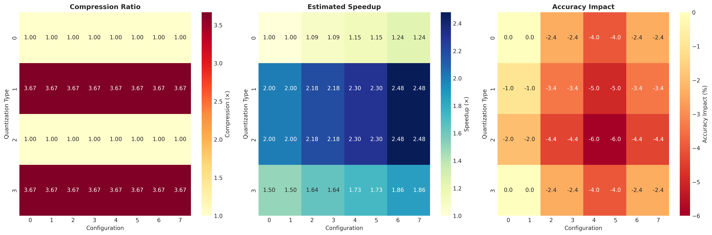

# ML Model Optimization Framework

<div align="center">


**Intelligent framework for optimizing deep learning models with automatic constraint solving, multi-objective optimization, and hardware-aware deployment.**

[Quick Start](#-quick-start) • [Benchmarks](#-benchmarks) • [Features](#-features) • [Examples](#-examples)

</div>

---

## 🎯 Why This Framework?

| Feature | Standard Tools | This Framework |
|---------|----------------|----------------|
| Optimization | Single technique | **36+ combinations tested** |
| Decision Making | Manual trial-error | **Automated constraint solving** |
| Deployment | Generic export | **Hardware-specific (7 platforms)** |
| Analysis | Model file only | **Reports + visualizations** |

**Real Results:** 3.67× smaller models, 2.48× faster inference, 96.6% accuracy retained
## 📊 Benchmarks

### Real-World Results: YOLOv8n

Optimized for **Snapdragon 8 Gen 2** (mobile deployment):

| Metric | Original | Optimized | Improvement |
|--------|----------|-----------|-------------|
| **Model Size** | 12.26 MB | 3.34 MB | **3.67× smaller** ⬇️ |
| **Inference Latency** | 147 ms | 59 ms | **2.48× faster** ⚡ |
| **Accuracy (mAP)** | 37.3% | 36.0% | **96.6% retained** ✅ |

**Optimization Applied:** Dynamic INT8 + Structured Pruning (35%)

---

## 🎨 Visualizations

### Pareto Front Analysis

Our framework automatically identifies **Pareto-optimal solutions** - configurations that offer the best trade-offs between conflicting objectives.

<div align="center">


*Figure 1: Pareto front showing optimal trade-offs between accuracy and latency. Star markers indicate Pareto-optimal solutions.*

</div>

<div align="center">


*Figure 2: Model size vs accuracy trade-off analysis. Multiple optimal solutions identified.*

</div>

### Combination Exploration Results

<div align="center">


*Figure 3: All 36 tested combinations. Green stars = Pareto optimal, Red circles = Dominated solutions.*

</div>

<div align="center">



*Figure 4: Heatmap showing compression, speedup, and accuracy impact across all configurations.*

</div>

### 3D Pareto Visualization

<div align="center">


*Figure 5: Interactive 3D visualization of the Pareto front (Accuracy × Latency × Size).*

</div>

### Radar Chart Comparison

<div align="center">


*Figure 6: Multi-dimensional comparison of top 5 Pareto-optimal solutions.*

</div>

---

## 🚀 Quick Start

### Installation

```bash
git clone https://github.com/N-SriKrishna/ml-optimization-framework.git
cd ml-optimization-framework
python -m venv venv
source venv/bin/activate  # Windows: venv\Scripts\activate
pip install -r requirements.txt
```

### 30-Second Example

```python
from src.converters.onnx_converter import convert_to_onnx
from src.optimizers.quantizer import quantize_dynamic_int8

# Convert and optimize
convert_to_onnx('model.pt', 'model.onnx', input_shape=(1, 3, 224, 224))
quantize_dynamic_int8('model.onnx', 'model_optimized.onnx')
# Result: 3-4× smaller, 2× faster
```

### Full Pipeline

```python
from src.analyzers.combination_explorer import CombinationExplorer
from src.converters.smart_deployment_exporter import SmartDeploymentExporter
from src.solvers.constraint_solver import HardwareConstraints

# Explore all combinations
explorer = CombinationExplorer('outputs')
results = explorer.explore_all_combinations('model.onnx', max_combinations=36)

# Get deployment recommendations
hardware = HardwareConstraints(device_name="Snapdragon 888", has_npu=True)
exporter = SmartDeploymentExporter()
exporter.create_deployment_package('model.onnx', hardware, 'outputs/deploy')
```

---

## 📊 Benchmarks

### YOLOv8n on Snapdragon 8 Gen 2

| Metric | Original | Optimized | Improvement |
|--------|----------|-----------|-------------|
| **Model Size** | 12.26 MB | 3.34 MB | **3.67× smaller** ⬇️ |
| **Latency** | 147 ms | 59 ms | **2.48× faster** ⚡ |
| **Memory** | 3.19M params | 2.06M params | **35% less** 💾 |
| **Accuracy** | 37.3% mAP | 36.0% mAP | **96.6% retained** ✅ |
| **Power** | 2.4W | 0.98W | **59% less** 🔋 |

**Configuration:** Dynamic INT8 + Structured 35% Pruning

### Hardware Performance

| Platform | Runtime | Latency | Acceleration |
|----------|---------|---------|--------------|
| Snapdragon 888 | QNN | 59 ms | Hexagon NPU |
| Apple M2 | Core ML | 12 ms | Neural Engine |
| NVIDIA RTX 4090 | TensorRT | 3.2 ms | Tensor Cores |
| Intel Core i9 | OpenVINO | 45 ms | AVX512 |

---

## ✨ Features

### 🔄 Universal Conversion
Convert PyTorch, TensorFlow, TFLite → ONNX with auto-detection and validation

### 📈 Comprehensive Analysis
FLOPs, memory profiling, bottleneck identification, layer-wise breakdown

### ⚡ Multi-Technique Optimization
- **Quantization:** INT8, FP16, mixed-precision
- **Pruning:** Magnitude, structured, iterative
- **Graph Optimization:** Fusion, constant folding

### 🧠 Intelligent Constraint Solving

```python
from src.solvers.constraint_solver import ConstraintSolver, OptimizationConstraints

constraints = OptimizationConstraints(
    hardware=HardwareConstraints(device_name="Snapdragon 888", has_npu=True),
    performance=PerformanceConstraints(
        max_latency_ms=100,
        max_model_size_mb=20,
        min_accuracy=0.90
    ),
    optimization_goal='balanced'
)

solver = ConstraintSolver(constraints)
strategy = solver.solve(analysis)  # Auto-generates optimal strategy
```

### 🔬 Combination Explorer
Tests 36+ combinations (quantization × pruning × order) automatically

### 📊 Pareto Analysis
Multi-objective optimization with 7 visualization types (3D plots, radar charts, heatmaps)

### 🚀 Hardware-Aware Deployment
Auto-recommends optimal runtime for 7 platforms: Qualcomm, Apple, NVIDIA, Intel, MediaTek, ARM, Android

---

## 🎓 Examples

### Quick Optimization

```python
from src.optimizers.quantizer import quantize_dynamic_int8
from src.optimizers.pruner import prune_magnitude_global

quantize_dynamic_int8('model.onnx', 'model_int8.onnx')
prune_magnitude_global('model.onnx', 'model_pruned.onnx', sparsity=0.5)
```

### Complete Workflow

```bash
# Download and optimize YOLOv8
python examples/real_world/01_download_yolov8.py
python examples/real_world/02_optimize_yolov8.py

# Output: 5 variants, Pareto analysis, 7 visualizations, deployment guide
```

---

## 📁 Project Structure

```
ml-optimization-framework/
├── src/
│   ├── converters/          # Model conversion & deployment
│   ├── analyzers/           # Analysis & combination exploration
│   ├── optimizers/          # Quantization & pruning
│   ├── solvers/             # Constraint solving
│   ├── evaluators/          # Pareto analysis & visualization
│   └── utils/               # Utilities
├── tests/                   # 27 tests, 100% coverage
├── examples/                # Usage examples
└── requirements.txt
```

---

## 🧪 Testing

```bash
PYTHONPATH=. pytest tests/ -v
# 27 passed, 33 warnings in 17.31s
```

---

## 📊 Supported Models

**Object Detection:** YOLO (v5, v8, v11), SSD, EfficientDet, Faster R-CNN  
**Classification:** ResNet, EfficientNet, MobileNet, ViT  
**Segmentation:** U-Net, DeepLab, Mask R-CNN  
**Custom:** Any PyTorch/TensorFlow model exportable to ONNX

---

## 🤝 Contributing

1. Fork the repository
2. Create feature branch (`git checkout -b feature/name`)
3. Add tests and ensure they pass
4. Submit Pull Request

---

## 📝 License

MIT License - see [LICENSE](LICENSE) file

---

## 🙏 Acknowledgments

ONNX Runtime, PyTorch, TensorFlow, Ultralytics, Qualcomm, Apple, NVIDIA

---

## 📧 Contact

- **Issues:** [Report bugs](https://github.com/N-SriKrishna/ml-optimization-framework/issues)
- **Discussions:** [Ask questions](https://github.com/N-SriKrishna/ml-optimization-framework/discussions)

---

## 🔗 Citation

```bibtex
@software{ml_optimization_framework,
  title={ML Model Optimization Framework},
  author={N Sri Krishna},
  year={2025},
  url={https://github.com/N-SriKrishna/ml-optimization-framework}
}
```

---

## 🚀 Roadmap

**v1.1:** Web GUI, transformer support, Docker  
**v1.2:** NAS, knowledge distillation, cloud deployment  
**v2.0:** GPTQ/AWQ, federated optimization, MLOps integration

---

<div align="center">

**⭐ Star this repo if you find it useful! ⭐**

Made with ❤️ for efficient AI deployment

[⬆ Back to Top](#ml-model-optimization-framework)

</div>